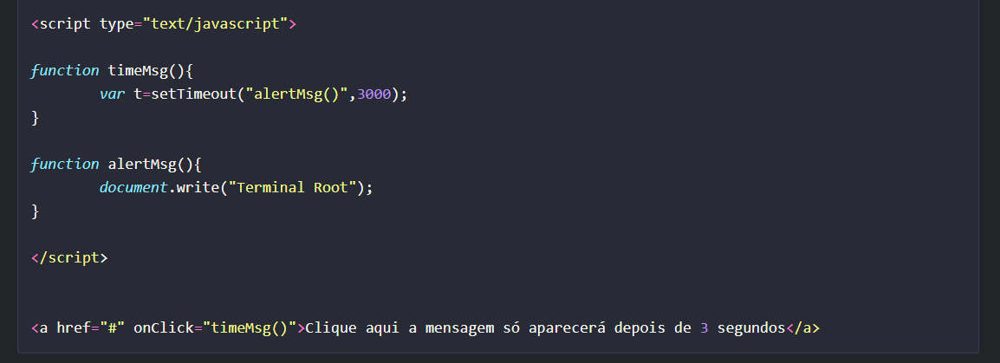
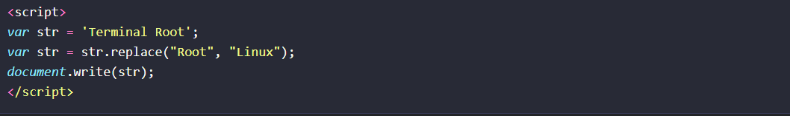

# Analise do codigo Javas Script
# codigo 1

Este código HTML contém um script JavaScript embutido que define duas funções e um link que chama uma dessas funções quando clicado.

A função timeMsg() é chamada quando o link é clicado. Ela define um temporizador que aguarda três segundos (3000 milissegundos) antes de chamar a função alertMsg().

A função alertMsg() é chamada após três segundos, como definido pela função timeMsg(). Ela escreve o texto "Terminal Root" no documento usando document.write().

O link <a> tem um evento onClick que dispara a função timeMsg() quando clicado. Isso faz com que a mensagem "Terminal Root" só apareça após três segundos de espera.

# codigo  2 

 var str = 'Terminal Root';

Declara uma variável chamada str e atribui a ela a string 'Terminal Root'.
str = str.replace("Root", "Linux");

Utiliza o método replace() para substituir a primeira ocorrência da substring "Root" na variável str pela substring "Linux". O resultado da substituição é armazenado de volta na variável str.
document.write(str);

Escreve o valor atual da variável str no documento HTML, resultando em "Terminal Linux" sendo exibido na página.

